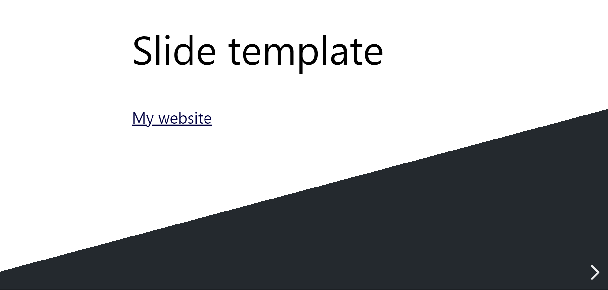
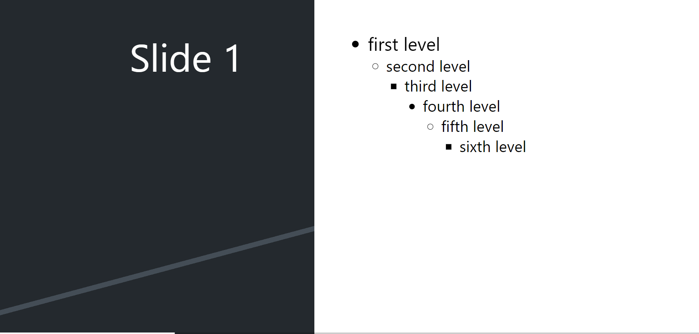
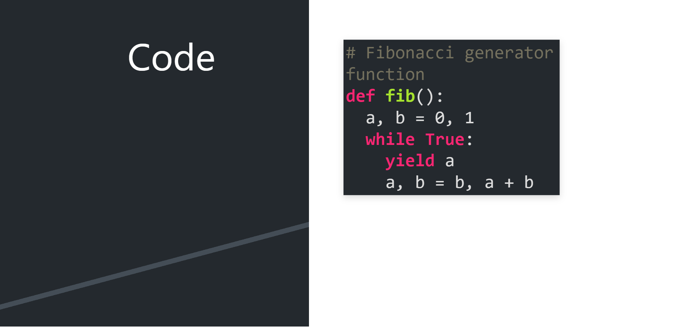

# html-slide-template

My reveal.js slide template, based on the Google Slides Paradigm theme

## Development

Run `yarn start` to serve the template during development. Hot reloading will be
enabled!
